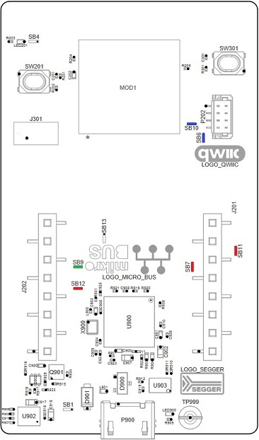

# RM126x Template Applications - RM126x DVK I2C Configuration

The [RM126x DVK][RM126x DVK user guide] does not support concurrent I2C and SPI access through its MikroE connector. The DVK needs to be configured to select one of the interfaces. The process for I2C configuration is described as follows.

The [RM1261][RM1261 DVK Schematic & PCB Assembly] and [RM1262 DVK Schematic & PCB Assembly][RM1262 DVK Schematic & PCB Assembly] diagrams should be referred to for more details.

# Configuration

Solder bridges on the top side of the DVK need to be configured as follows.

| Solder Bridge Designation | Configuration | Colour Indication | MikroE / Qwiic Function |
|---------------------------|---------------|-------------------|-------------------------|
| SB6                       | Don't Care    |   Blue            | QWIIC_I2C_SCL           |
| SB7                       | Open          |   Red             | MIKROE_SPI_MISO         |
| SB9                       | Closed        |   Green           | MIKROE_I2C_SDA          |
| SB10                      | Don't Care    |   Blue            | QWIIC_I2C_SDA           |
| SB11                      | Open          |   Red             | MIKROE_SPI_MOSI         |
| SB12                      | Open          |   Red             | MIKROE_UART_TX          |

The locations of the solder bridges are shown below.

Solder bridges on the bottom side of the DVK need to be configured as follows.

| Solder Bridge Designation | Configuration | Colour Indication | MikroE / Qwiic Function |
|---------------------------|---------------|-------------------|-------------------------|
| SB5                       | Closed        |   Green           | MIKROE_I2C_SCL          |
| SB8                       | Open          |   Red             | MIKROE_UART_RX          |

The locations of the solder bridges are shown below.

[RM126x module datasheet]: <https://www.ezurio.com/documentation/datasheet-rm126x-lorawan-module>
[RM126x DVK user guide]: <https://www.ezurio.com/documentation/user-guide-rm126x-development-kit>
[RM1261 DVK Schematic & PCB Assembly]: <https://www.ezurio.com/documentation/schematic-pcb-assembly-dvk-rm1261-devboard>
[RM1262 DVK Schematic & PCB Assembly]: <https://www.ezurio.com/documentation/schematic-pcb-assembly-dvk-rm1262-devboard>
